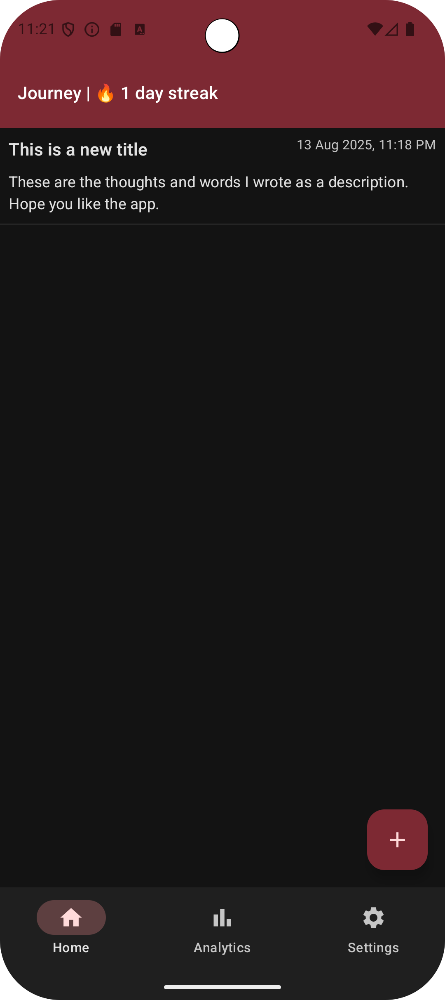
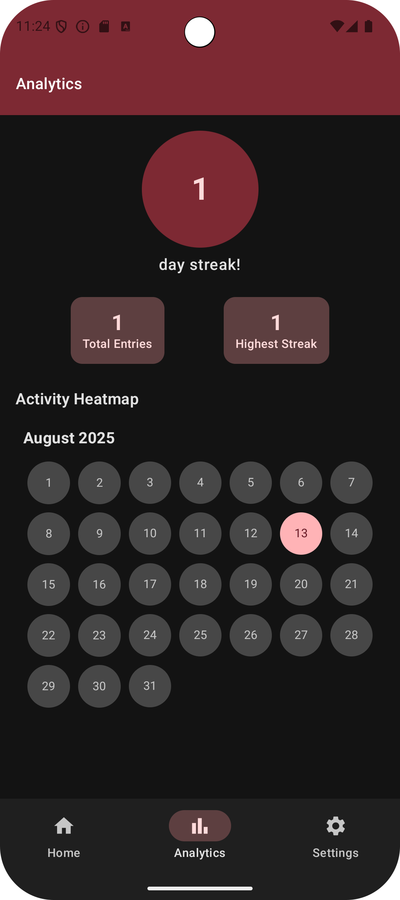
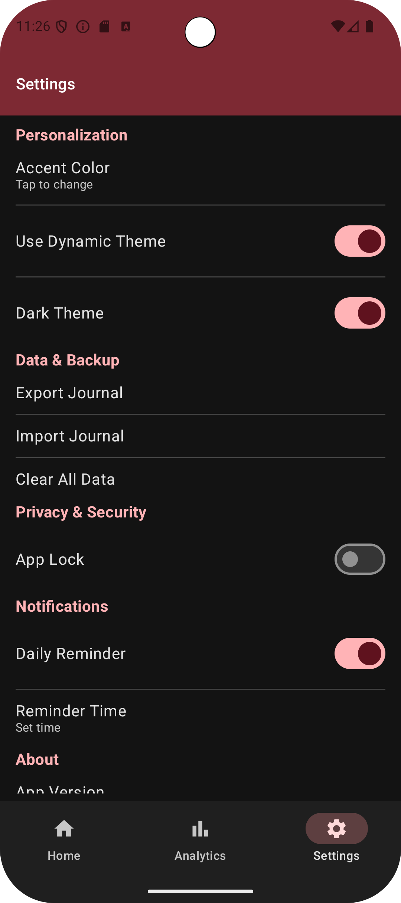

# Journey Journal App

Journey is a personal journaling app built with Jetpack Compose and Kotlin. It helps users record daily entries, analyze their journaling habits, and personalize the app experience.

## Screenshots

  

## Features

- **Journal Entries:** Add, edit, and view daily journal entries.
- **Analytics:** Visualize journaling patterns and statistics with streaks count.
- **Personalization:** Customize accent color, theme (dark/light/dynamic), and more.
- **Data & Backup:** Export, import, and clear journal data.
- **Privacy & Security:** Enable app lock and daily reminders.
- **Modern UI:** Built with Material 3 and Jetpack Compose.

## Tech Stack

- Kotlin
- Jetpack Compose
- Material 3
- Hilt (DI)
- DataStore (preferences)
- MVVM architecture

## Getting Started

### Prerequisites

- Android Studio (2025.1.2 or newer)
- JDK 17+
- Android device or emulator (API 24+)

### Setup

1. **Clone the repository:**
   ```sh
   git clone https://github.com/Tobibur/Journey.git 
   cd journey
    ```
2. **Open the project in Android Studio:**
3. **Sync Gradle:**
   - Click on "Sync Now" when prompted to sync Gradle files.
4. **Run the app:**
   - Connect your Android device or start an emulator.
   - Click the "Run" button in Android Studio.
   - Select your device/emulator and wait for the app to launch.
   - You should see the Journey app running on your device/emulator.
5. **Explore the app:**

### Features

   - Create a new journal entry by clicking the "+" button.
   - View your entries in the list.
   - Access analytics to see your journaling patterns.
   - Customize settings like theme and accent color.

## Contributing
Contributions are welcome! If you'd like to contribute, please follow these steps:
1. Fork the repository.
2. Create a new branch for your feature or bug fix.
3. Make your changes and commit them with clear messages.
4. Push your changes to your forked repository.
5. Create a pull request explaining your changes.
6. Wait for review and feedback.

## License
This project is licensed under the MIT License. See the [LICENSE](LICENSE) file for details
